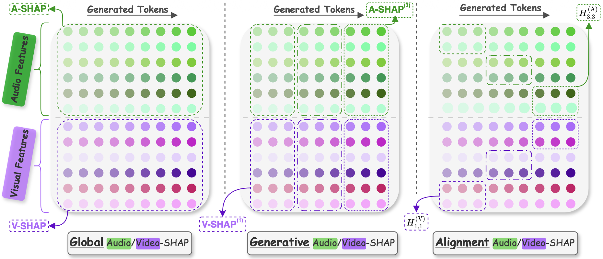

# Dr. SHAP-AV: Decoding Relative Modality Contributions via Shapley Attribution in Audio-Visual Speech Recognition

<div align="center">

[](?)
[](https://umbertocappellazzo.github.io/Dr-SHAP-AV)
[](https://github.com/umbertocappellazzo/Dr-SHAP-AV)
[](https://github.com/umbertocappellazzo/Dr-SHAP-AV/stargazers)

**[Umberto Cappellazzo¹](#) · [Stavros Petridis¹²](#) · [Maja Pantic¹²](#)**

¹Imperial College London ²NatWest AI Research

### 📄 [`Paper`](?) | 🌐 [`Project Page`](https://umbertocappellazzo.github.io/Dr-SHAP-AV/) | 💻 [`Code`](https://github.com/umbertocappellazzo/Dr-SHAP-AV) | 🔖 [`BibTeX`](#-citation)

</div>

---

## 📢 News
- **[03-2026]** 🚀 Code and models released!
- **[03-2026]** 📝 Paper submitted to arXiv.


---

## 📋 Table of Contents

- [Highlights](#-highlights)
- [Setup](#-setup)
- [Training](#-training)
- [Evaluation](#-evaluation)
- [Checkpoints](#-checkpoints)
- [Citation](#-citation)
- [Acknowledgements](#-acknowledgements)
- [Contact](#-contact)

---

## 🌟 Highlights

Dr. SHAP-AV is a unified Shapley-based framework for understanding how AVSR models balance audio and visual modalities across model architectures, decoding stages, and acoustic conditions. 

<div align="center">
  
  <p><i>The three proposed SHAP-based analyses in Dr. SHAP-AV: Global/Generative/Temporal Alignment SHAP.</i></p>
</div>

Through Dr. SHAP, we find multiple key findings:
- **Persistent Audio Bias**: AVSR models tend to shift toward visual reliance as noise increases, yet maintain high audio contributions
even under severe degradation.
- **Dynamic Generation Shift**: Whisper-Flamingo and Omni-AVSR progressively increase audio reliance during generation, while AV-
HuBERT maintains stable modality balance throughout.
- **Robust Temporal Alignment**: Both audio and visual modalities independently maintain temporal correspondence between input features
and output tokens, even under severe acoustic noise.
- **Noise-Type Sensitivity**: The degree of visual shift depends on noise type and severity: more challenging acoustic conditions induce
greater reliance on visual information.
- **Architecture-Dependent Duration Effect**: The relationship between utterance duration and modality balance is architecture-dependent, with no universal trend across models or conditions.
- **SNR-Driven Modality Balance**: Modality contributions are determined by acoustic conditions rather than recognition difficulty.

---

## 🛠 Setup 
This repository contains the code to reproduce the results of our paper. Specifically, we include here the three `LLM-based models`: **1)** Llama-AVSR, **2)** Llama-SMoP, **3)** Omni-AVSR. Below we point to the repositories regarding the three `cross-attention encoder-decoder architectures`. Since each of them requires an ad-hoc environment, we created three dedicated repositories. On the contrary, Llama-AVSR, Llama-SMoP, and Omni-AVSR share the same environment.

- [Auto-AVSR](https://github.com/umbertocappellazzo/auto_avsr_shap)
- [AV-HuBERT](https://github.com/umbertocappellazzo/av_hubert_shap)
- [Whisper-Flamingo](https://github.com/umbertocappellazzo/whisper-flamingo-shap)

### 1) Installation
Our setup follows that of [Llama-AVSR](https://github.com/umbertocappellazzo/Llama-AVSR) and [Omni-AVSR](https://github.com/umbertocappellazzo/Omni-AVSR). 

Install necessary dependencies: 

```bash
   pip install -r requirements.txt
   cd av_hubert
   git submodule init
   git submodule update
   cd fairseq
   pip install --editable ./
```

### 2) Datasets Pre-processing

For our experiments, we are only interested in the test set of LRS3 and LRS2. So please follow the instructions in [Omni-AVSR](https://github.com/umbertocappellazzo/Omni-AVSR) to process them. I can share the pre-processed test sets with you if you need to.

---

## Dr. SHAP-AV

### 🌐 Global Audio/video SHAP

We provide below three examples to compute the Global audio/visual SHAP contributions. Before starting using Dr/ SHAP-AV, make sure you **1)** have a wandb account to track your experiments and **2)** have access to the pre-trained Llama 3.2-1B model (i.e., you need to request access from HF [here](https://huggingface.co/meta-llama/Llama-3.2-1B)). You also have to download the AV-HuBERT Large model pretrained on LRS3 + VoxCeleb2, accessible [here](https://dl.fbaipublicfiles.com/avhubert/model/lrs3_vox/clean-pretrain/large_vox_iter5.pt).

The most important arguments to specify regardless of the pre-trained model used are:

<details open>
  <summary><strong>Main Arguments</strong></summary>
    
- `wandb-project`: The wandb project to monitor and track the global SHAP computations.
- `exp-name`: The name of the current experiment.
- `pretrained-model-path`: The path to the pre-trained model you want to apply the analyses.
- `root-dir`: The directory where the LRS3/LRS2 test sets + labels files are located.
- `test-file`: The test filename.
- `pretrain-avhubert-enc-video-path`: The path to the AV-HuBERT ckpt.
- `compute-shap`: Flag to allow SHAP computations. If set to False (default), we only evaluate the pre-trained model and compute the WER on the test set. Hence, all the subsequent arguments can be skipped.
- `shap-alg`: The algorithm from the shap library to compute the shapley matrix. Choices: [`sampling`, `permutation`].
-  `num-samples-shap`: The number of coalitions to sample.
-  `output-path`: The path to save the SHAP values for further analyses. **This folder must be created beforehand!**
-  `noise-type`: The acoustic noise file to sample from. Choices: [`babble`, `music`, `sound`, `speech`].
-  `decode-snr-target`: The SNR level of acoustic noise to test on.

</details>

**Example 1**: We compute Global SHAP contributions for Llama-AVSR using permutation SHAP in clean conditions sampling 2000 coalitions. You can reduce the number of coalitions to make the computation faster.

```Shell
python eval_LlamaAVSR.py --wandb-project [wandb_project] --exp-name LRS3_Llama-AVSR_shap_permutation_clean --root-dir [/root/directory/path] --pretrained-model-path [/path/to/ckpt/LRS3_audiovisual_avg-pooling_AVH-Large_Whisper-M_Llama3.2-1B_pool-4-2_LN_seed7/model_avg_1.pth] --modality audiovisual --pretrain-avhubert-enc-video-path [/path/to/avhubert/ckpt] --audio-encoder-name openai/whisper-medium.en --rank 32 --alpha 4 --llm-model meta-llama/Llama-3.2-1B --unfrozen-modules peft_llm --add-PEFT-LLM lora --downsample-ratio-audio 4 --downsample-ratio-video 2 --test-file lrs3_test_transcript_lengths_seg24s_LLM_lowercase.csv --compute-shap True --shap-alg permutation --num-samples-shap 2000 --output-path-shap [/path/to/output/folder]
```

**Example 2**: We compute Global SHAP contributions for Llama-SMoP using permutation SHAP in noisy conditions (-10dB, babble noise) sampling 2000 coalitions. 

```Shell
python eval_LlamaSMoP.py --wandb-project [wandb_project] --exp-name LRS3_Llama_SMoP_shap_permutation_minus10dB_babblenoise --root-dir [/root/directory/path] --pretrained-model-path [/path/to/ckpt/LRS3_SMoP_audiovisual_avg-pooling_AVH-Large_Whisper-M_Llama1B_pool-4-2_seed7] --modality audiovisual --pretrain-avhubert-enc-video-path [/path/to/avhubert/ckpt] --audio-encoder-name openai/whisper-medium.en --rank 32 --alpha 4 --llm-model meta-llama/Llama-3.2-1B --unfrozen-modules peft_llm --add-PEFT-LLM lora --downsample-ratio-audio 4 --downsample-ratio-video 2 --test-file lrs3_test_transcript_lengths_seg24s_LLM_lowercase.csv --MoP-experts 4 --MoP-topk 2 --compute-shap True --shap-alg permutation --num-samples-shap 2000 --output-path-shap [/path/to/output/folder] --decode-snr-target -10 --noise-type babble
```

**Example 3**: We compute Global SHAP contributions for Omni-AVSR using sampling SHAP in noisy conditions (0dB, music noise) sampling 2000 coalitions. 

```Shell
python eval_OmniAVSR.py --wandb-project [wandb_project] --exp-name LRS3_OmniAVSR_shap_sampling_0dB_musicnoise --root-dir [/root/directory/path] --pretrained-model-path [/path/to/ckpt/LRS3_OmniAVSR_Matry_weights_1-15-1_avg-pooling_Whisper-M_Llama3.2-1B_LoRA_task-specific_sharedLoRA_pool-audio4-16_video2-5_LN_seed7] --modality audiovisual --audio-encoder-name openai/whisper-medium.en --pretrain-avhubert-enc-video-path [/path/to/avhubert/ckpt] --llm-model meta-llama/Llama-3.2-1B --unfrozen-modules peft_llm lora_avhubert --use-lora-avhubert True --add-PEFT-LLM lora --rank 32 --alpha 4 --downsample-ratio-audio 4 16 --downsample-ratio-video 2 5 --matry-weights 1. 1.5 1. --is-task-specific True --use-shared-lora-task-specific True --test-file lrs3_test_transcript_lengths_seg24s_LLM_lowercase.csv --test-specific-modality True --task-to-test audiovisual --test-specific-ratio True --downsample-ratio-test-matry-audio 4 --downsample-ratio-test-matry-video 2 --compute-shap True --shap-alg sampling --num-samples-shap 2000 --output-path-shap [/path/to/output/folder] --decode-snr-target 0 --noise-type music
```


## 🎁 Checkpoints

We provide below the three ckpts (Llama-AVSR, Llama-SMoP, Omni-AVSR) we used for our analyses on the LRS3 dataset. Just contact me would you like to work on the LRS2 checkpoints. 

| Model | Dataset | Link |
|-------|---------|----|
| LRS3_audiovisual_avg-pooling_AVH-Large_Whisper-M_Llama3.2-1B_pool-4-2_LN_seed7 | LRS3 | [Link](https://www.doc.ic.ac.uk/~ucappell/) |
| LRS3_SMoP_audiovisual_avg-pooling_AVH-Large_Whisper-M_Llama1B_pool-4-2_seed7 | LRS3| [Link](https://www.doc.ic.ac.uk/~ucappell/) |
| LRS3_OmniAVSR_Matry_weights_1-15-1_avg-pooling_Whisper-M_Llama3.2-1B_LoRA_task-specific_sharedLoRA_pool-audio4-16_video2-5_LN_seed7 | LRS3| [Link](https://www.doc.ic.ac.uk/~ucappell/) |


---


## 🔖 Citation

If you find our work useful, please cite:

```bibtex
@article{cappellazzo2026ODrSHAPAV,
  title={Dr. SHAP-AV: Decoding Relative Modality Contributions via Shapley Attribution in Audio-Visual Speech Recognition},
  author={Umberto, Cappellazzo and Stavros, Petridis and Maja, Pantic},
  journal={arXiv preprint arXiv:?},
  year={2026}
}
```

---


## 🙏 Acknowledgements

- Our code relies on [Llama-AVSR](https://github.com/umbertocappellazzo/Llama-AVSR), [Omni-AVSR](https://github.com/umbertocappellazzo/Omni-AVSR), [AV-HuBERT](https://github.com/facebookresearch/av_hubert), [Whisper-Flamingo](https://github.com/roudimit/whisper-flamingo), and [Auto-avsr](https://github.com/mpc001/auto_avsr) repositories.

---

## 📧 Contact

For questions and discussions, please:
- Open an issue on GitHub
- Email: umbertocappellazzo@gmail.com
- Visit our [project page](https://umbertocappellazzo.github.io/Dr-SHAP-AV/) and our [preprint](https://arxiv.org/abs/?)

---


